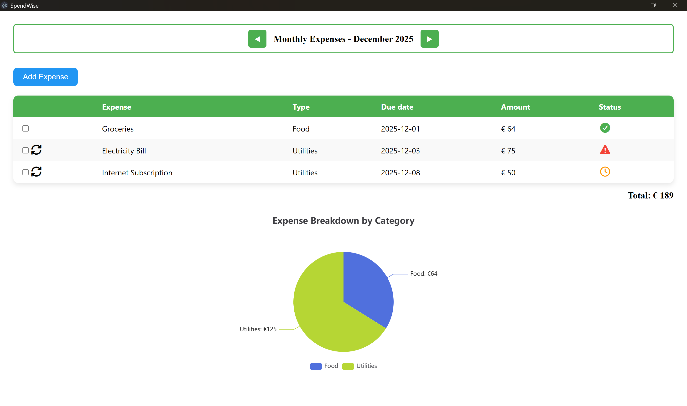

# SpendWise



SpendWise is a desktop application for managing and tracking personal expenses. Built with Angular 21 and Electron, it provides an intuitive interface for recording expenses, viewing monthly summaries, and receiving spending reminders.

## Features

- **Expense Tracking**: Add and manage your daily expenses with an easy-to-use form
- **Monthly Summary**: View comprehensive charts and statistics of your monthly spending
- **Reminders**: Set up reminders to help you stay on budget (To be implemented)
- **Desktop Application**: Built with Electron for a native desktop experience
- **Responsive Design**: Clean, modern UI with Font Awesome icons

## Tech Stack

- **Frontend**: Angular 21
- **Desktop**: Electron 39
- **Charts**: ECharts via ngx-echarts
- **Database**: SQLite (using `better-sqlite3`) 
- **Build Tool**: Angular CLI 21

## Getting Started

### Prerequisites

- Node.js (with npm)
- Angular CLI

### Installation

```bash
npm install
```

## Running the Application

To start the desktop application:

```bash
npm start
```

This command builds the Angular application and launches it in Electron.

## To be implemented

- Reminders
- Updated/Delete expense
- Yearly summary of the expenses